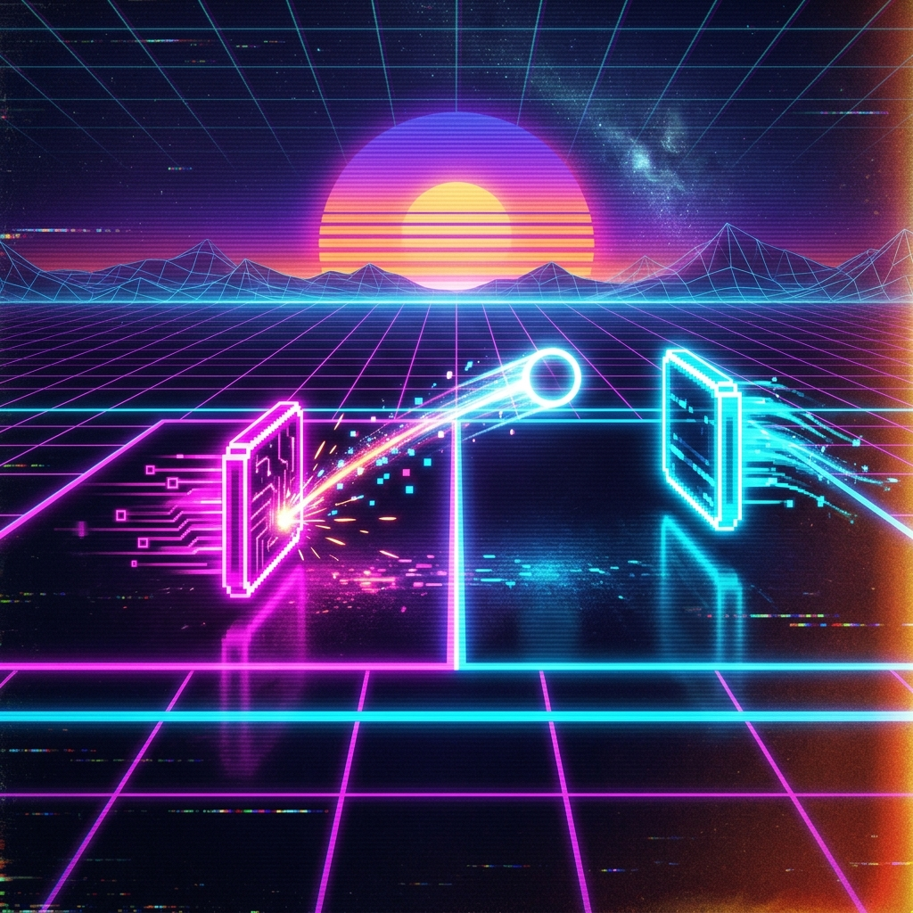

# Pong — Vibe Coded 🎮

<p align="center">
  
</p>

## Overview

A **modern, vibe-coded reimagination** of the classic Pong arcade game. Built entirely through AI-assisted "vibe coding," this project features neon-soaked aesthetics, smooth animations, and addictive gameplay — proving that great games can emerge from creative AI-human collaboration.

---

## Key Features

- **Retro-futuristic aesthetics** — Neon glow effects, synthwave color palette
- **Smooth gameplay** — Fluid paddle movement and ball physics
- **AI opponent** — Computer-controlled paddle with adjustable difficulty
- **Score tracking** — Real-time score display
- **Vibe coded** — Built through creative AI-assisted development

---

## Technology Stack

| Technology | Purpose |
|---|---|
| JavaScript | Game logic |
| HTML5 Canvas | Game rendering |
| CSS3 | Neon styling and effects |

---

## How to Play

1. Use **arrow keys** or **mouse** to move your paddle
2. Deflect the ball past the AI opponent to score
3. First to reach the target score wins!

---

## Installation & Setup

```bash
git clone https://github.com/srivatsacool/Pong_Vibe_Coded
cd Pong_Vibe_Coded
# Open index.html in your browser
npx serve .
```

---

## Author

**Srivatsa Gorti**

---
